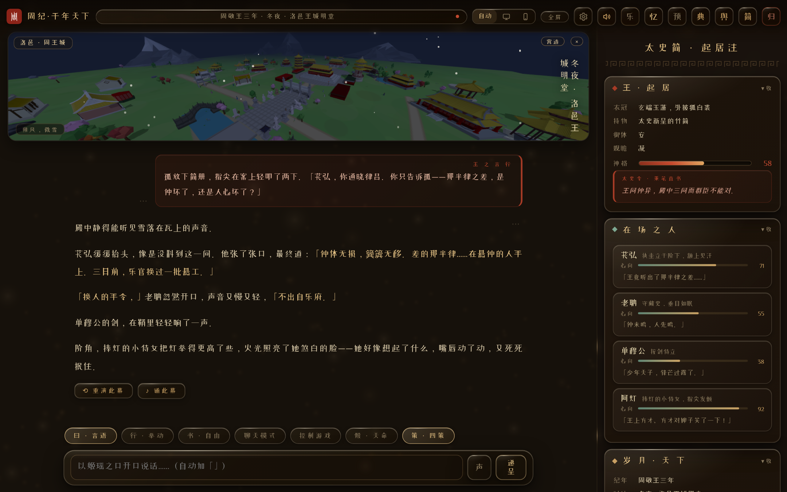
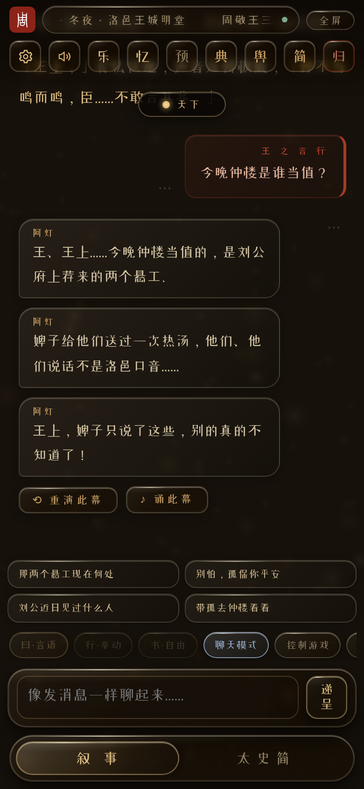
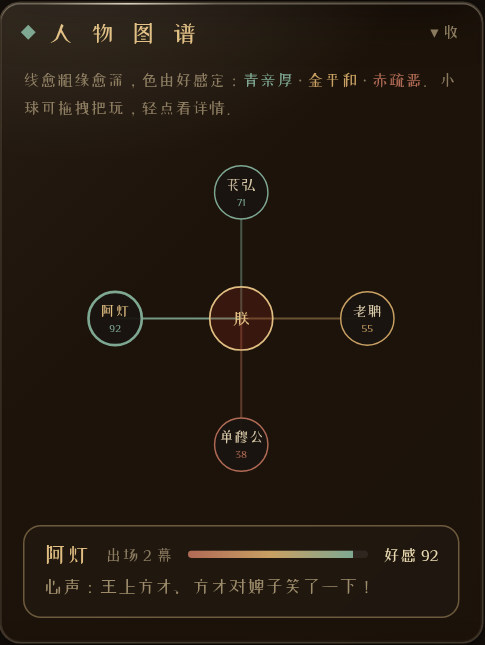
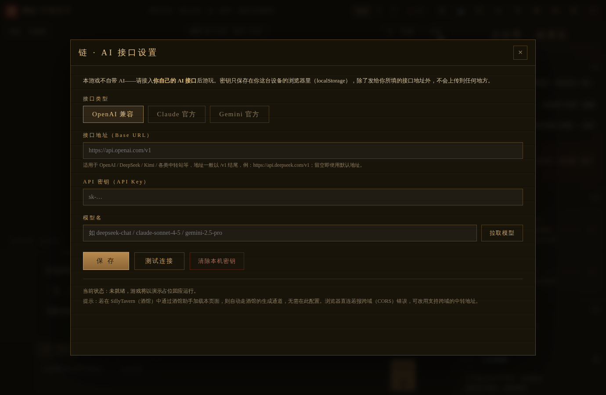

# 周纪 · 千年天下

**永生周天子 · 你即姬瑶 · 天下由 AI 扮演**

*一款单文件、免安装的 AI 驱动历史角色扮演游戏 —— 文字为骨，三维天下为形*

### 🎮 立即游玩 → [**ekibenya.github.io/RitusZhou**](https://ekibenya.github.io/RitusZhou/)

**备用线路（同步更新）** → [**ritus-zhou.vercel.app**](https://ritus-zhou.vercel.app/)

*免下载 · 免安装 · 手机电脑皆可 · 配好你自己的 AI 接口即开局*

[简体中文](README.md) | [English](README_EN.md)

---

> 洛邑的钟声敲了一千年。
>
> 诸侯换了一茬又一茬，史官换了一支又一支笔，唯有明堂之上那位天子——**姬瑶**——从未老去。
>
> 你就是她。没有固定选项，没有既定结局，没有人等你做出「正确的选择」。你说的每一句话、做的每一个举动，都会被太史令记入起居注，被殿中之人反复讲述，成为这千年天下的一部分。

**《周纪·千年天下》** 是一款类 SillyTavern 的 AI 角色扮演游戏：AI 扮演整个天下——太师、诸侯、刺客、方士、贩夫走卒——而你以永生周天子之身，在西周到战国的千年长河中书写自己的史书。对话框上方，是一整个可游历、可营造、可征伐的实时三维天下。

*2.0 全新界面 · 三维天下浮岛 + 液态玻璃 + 太史简起居注一屏纵览*

## ✦ 游戏一览

| | |
|---|---|
|  |  |
| **2.0 弥散光封面** — 无框光字、弥散暖雾光尘，点「链 · 接入」配好你自己的 AI 就能开局 | **十个历史开局 + 自定义开局** — 从前519年王子朝之乱到前212年咸阳软禁；开局零可自选时代、地点、人物乃至任意年份 |

## ✦ 文字侧 · AI 世界叙事

- **🎭 无固定选项、无预设结局** — 言语 / 举动 / 自由 / **控制游戏**四种行动方式外加**聊天模式**；「控制游戏」的敕令（起马厩×2 / 拆酒楼 / 攻打粮仓 / 寻老聃 / 去城南 / 移驾郢）由**游戏亲自解析执行**，三维城池立时变化，AI 只负责就既成事实叙事
- **⚡ 流式输出** — 字随生成边打边现（OpenAI 兼容 / Claude / Gemini 三家全支持），长回复不再干等；任何流式故障自动回退整段生成
- **📖 千年世界书** — 周室、百家、列国、风貌、秦汉、后世等九大类条目按上下文自动激活；玩家可自写条目、上传 SillyTavern 世界书
- **🀄 太史简状态栏** — 每回合更新：王之起居（衣冠 / 持物 / 御体 / 观瞻 / 神格 / 史笔）、在场之人好感与心声、岁月天下大势；2.0 新增**人物关系图谱**与**编年史**两个常驻栏目
- **🧠 长程记忆 · 太史长卷** — 每一轮自动摘为一条编年纪要，**永久保存并每轮全文送呈 AI**：即使你的模型上下文很短、正文历史被截断，它也始终记得这一局发生过什么；支持手记入卷、逐条编辑删改、随存档封存
- **🏗️ 叙事成真 · 营造单** — 太史所记的天下变动**实时作用于三维城池**：天子下令兴建的马厩酒楼会真的在城中落成，叙事中焚毁的屋舍会当场起火倾颓，名士来投则其人现身街巷
- **💾 存档简册** — 本地存档最多十二枚，随时续前缘；**🎵 古乐配景** — 内置十一首古琴 / 楚辞乐章随场景切换

## ✦ 2.0 新篇 · 快意操作

*聊天模式 · 与在场之人像即时通讯一样快聊，输入框上方是 AI 代拟的「懒人四策」*

- **💬 聊天模式** — 一键切换：AI 不写旁白剧情，只由在场之人像聊天软件一样开口，气泡左右分列、秒回短句、免状态栏全速出字；随时切回叙事模式无缝衔接
- **🎲 天命明骰** — 「骰」钮开启后，每次言行自动掷出明骰（1–100，大凶到大吉五档），AI 严格按天数裁定成败，不得逆天改命
- **🧭 懒人四策** — 每幕之后 AI 替你拟四条可直接点选的下一步（言语试探 / 果断行动 / 追问细节 / 出人意料），点之即递呈；「策」钮或设置随时关闭
- **🎙️ 语音输入 ＋ 🔊 语音朗读** — 输入栏「声」钮说话成文（电脑默认开、手机默认关）；「声 · 语音」设置页支持浏览器内置与自带 TTS 接口朗读正文，全读 / 仅对话 / 仅旁白三档，可自动朗读新幕
- **📱 全屏阅读** — 「全屏」进入纯文字模式，上下栏滑出让位；悬浮金点呼出无框输入，回车即递呈；「天下」灵动岛随时唤回三维画面
- **✏️ 每幕每言可修可删** — 任何一条消息角落的 ⋯ 可修改、删除（连同对应问答成对删）、**由此幕重来**（抹去其后全部剧情）；记忆长卷同步修剪
- **🔁 重演翻稿** — 「重演此幕」后出现 ◀ 2／3 ▶＋：每一稿都保留，来回翻看比对，走到最后一稿再按一下就再演新稿，全部随存档保存
- **🎨 对话字色** — 正文引号内的台词以可选颜色区分（青蓝 / 竹青 / 鎏金 / 藕荷 / 月白 / 自选取色 / 不着色），默认鎏金
- **🔋 低配模式** — 封面右上「低配」或设置内一键开启：撤实时模糊、背景光斑歇屏、三维降档锁 30 帧，手机防发热防卡顿；**默认关闭，画质零妥协**

## ✦ 2.0 新篇 · 酒馆生态全兼容

把你在 SillyTavern 攒下的家当整套搬进来，全部**真实作用于发给 AI 的请求**：

- **🎴 角色卡导入** — 设置「卡 · 角色卡」页签直接吃 ST 导出的**角色卡 PNG**（内嵌数据）或 V2/V3 JSON：人物化作世界书条目，正文提到名字即按卡中设定登场，卡内附带世界书一并生效；整卡一键启停 / 移除
- **📚 世界书高级字段** — 次级关键词（须同时命中）、注入顺序、触发概率、扫描深度、递归扫描（条目点亮条目），导入自动生效，手写条目亦有对应输入项
- **🧾 预设全功能** — 导入 ST 聊天补全预设 JSON，逐条编辑 / 启停 / 调注入位置 / 导出
- **🔤 正则脚本** — 导入 ST 正则 JSON 或手写：「仅显示」只改你看见的正文，「显示并发送」连同送回 AI 的历史一起改
- **🧩 助手脚本沙箱** — 运行酒馆助手（Tavern Helper）风格 JS 脚本：隔离沙箱执行，支持 eventOn / getChatMessages / setChatMessage 等常用接口，触碰不到你的密钥
- **🧠 思维链自动折叠** — think / thinking / reasoning / 思维链等标签自动折叠为「✦ 推演之思」，且**从发回 AI 的历史与记忆中剥除**
- **🔍 提示词透视** — 链页一键查看上次实际发送的完整请求：系统提示按段折叠、对话逐条、字数与 token 估算，排查「AI 为什么不记得」一目了然
- **🎛️ 高级采样 ＋ 副模型 ＋ 接口档案** — temperature / top_p / max_tokens 自定；配一个便宜副模型专跑绘图提示词、四策、来信等杂务；多套接口配置存成档案一键切换
- **🖼️ 绘此幕** — 接自己的 OpenAI images 兼容绘图接口，每幕一键生成场景插画入玻璃相框；图库存本机 IndexedDB 并自动瘦身（手机留 10 张、电脑 30 张），存档只记编号不撑爆内存

## ✦ 2.0 新篇 · 史官三器

*太史简 · 人物图谱 —— 小球可拖拽把玩，弹簧回位，轻点看心声*

- **🕸️ 人物关系图谱** — 太史简内常驻：NPC 环绕天子成网，线越粗出场越多、颜色随好感青金赤渐变；**任何小球（含中心的朕）都能抓着甩**，缘线实时跟随、群球联动牵引，松手弹簧回位；轻点看好感条、近况与心声
- **📜 编年史** — 长卷记忆化作按纪年分段的竖轴大事记，一眼纵览本局千年
- **📖 成书导出** — 把整局剧情清洗排版（去状态栏、去思维链、应用正则）连同插画输出为一册深色古卷风格的独立网页，可读可分享可打印

## ✦ 2.0 新篇 · 传世

- **🔗 开局码分享** — 自定义开局一键复制口令链接：友人点开链接（或粘贴口令）即得一模一样的开局，从头开演自己的版本
- **📬 闲时来信** — 离开二十个时辰以上再回来，御前自动呈上一封 AI 依剧情写就的短信（宫中来报 / 边关急件 / 故人来信），抛个钩子等你续局
- **📅 自定义年份** — 开局零不止选时代卡：直接填任意年份（前505 / 620 皆可）即可点亮继续，自动匹配最近的时代
- **📦 数据尽在掌握** — 聊天记录 / 记忆 / 世界书 / 预设可**逐项导出**，也可一键导出全部数据；一键清除本机一切痕迹

## ✦ 三维天下 · 八城与无垠旷野

- **🏯 八城按国色营造** — 洛邑与七国都邑（周金 / 秦黑 / 楚赤 / 齐紫 / 燕蓝 / 韩绿 / 赵土金 / 魏青碧），移驾他国，头顶的城池随之化为该国街市；457 件中国古建与家具低模素材全数在场，洛邑最为宏大
- **🏔️ 真实地貌** — 多面体棱峰连岭成脉、雪线参差，裸岩山趾与贴地岩席摊进草原，砾石裙、泥土黄斑、杂色草皮层层过渡；平野上有破土露岩
- **🌍 无垠旷野** — Minecraft 式分块生成，草原丘山随镜头无限延展，御道通向天际，四野任意处皆可营造
- **🚶 游历模式** — 电脑 WASD、手机虚拟摇杆自由行走；**万屋皆可入**：凡成屋之形的建筑正面皆有门，走近即入（民居 / 铺面 / 书房 / 寝宫 / 明堂 / 酒堂 / 守藏室八式室内）
- **🗺️ 天下棋盘** — 舆图化作可交互棋盘，拖动你这枚棋子落子他处即可移驾巡狩
- **🖥️ 三维亦可全屏** — 营造面板内一键让三维画面铺满全屏，天下尽收眼底

*洛邑王城 · 上帝视角实时全景*

*无限旷野 · 连岭山脉与杂色草原*

## ✦ 营造模式 · 天子造城

- **🏗️ 上帝视角营造**（Pocket Build 式）— 金色网格铺地，「营造清单」里全部素材明码标价分八类陈列；幽灵预览、拖拽落格、**360°自由旋转**（滑条 + 45°步进）、**X/Y/Z三轴斜置**（「轴」面板，每按10°，歪塔翻箱皆可）、**摆放零限制**（允许与既有建筑交叉嵌套）、**0.5~5倍缩放**、定建扣金
- **🛣️ 七式道路** — 泥泞小径 / 夯土官道 / 砂石道 / 山径垫步 / 石板道 / 御道 / 木栈道，每段 8×8 米与御道同规，逐段拼接成路网
- **🏠 入内布置** — 点选任意建筑「入内」，揭顶俯视室内，家具托盘网格摆设，**每屋一档独立存档**，游历走进门同样能看到你的陈设
- **🧑‍🤝‍🧑 众生与军旅** — 街巷众生游走（士农工商百业 + 各城史实人物：洛邑老聃公输班、曲阜孔门、姑苏孙武、郢屈原……），点击「对话」入史；可招纳人物、直出成建制军队（单兵 / 伍 / 营 / 军），点地行军、点目标攻击，战报全文入史
- **🛡️ 御前卫队** — 天子前二后二四卫随驾，可增员减员；剧情遇刺自动合围搏杀，软禁开局则孤身无卫；**⚡ 移驾** — 点天子再点目标格，确认即瞬移，卫队同步落位
- **🧨 拆除与兵毁** — 万物可拆：敕令拆除返金，军队攻毁焚椽倾颓，两者动画与入史文本不同；树竹花石草垛皆可清除
- **📜 奏报入史** — 兴作与拆除先记入营造总账，尽情盖完一批后点「奏报（发送给AI）」，太史令一句并录

*营造清单 · 石板道与御道已铺就*

*「入内」揭顶布置室内 · 每屋独立存档*

## ✦ 操作指南（说明书）

**顶栏（从左至右）**

| 按钮 | 作用 |
|---|---|
| ⚙ 设 | 设置总入口（七个页签，见下） |
| 🔇 静音 | 一键静音 / 恢复 |
| 乐 | 编钟雅乐：选曲、暂停、音量 |
| 忆 | 太史长卷：长程记忆逐条查看 / 编辑 / 手记入卷 |
| 预 | 自定义预设：导入 / 逐条编辑 / 导出 |
| 典 | 千年世界书图鉴（右上齿轮直达世界书编辑） |
| 舆 | 天下大势舆图（可拖棋子移驾） |
| 简 | 存档简册：十二枚本地存档 |
| 归 | 归题名 / 另择开局 |
| 全屏 | 纯文字阅读模式（滚动地名条右端红点为演示开关） |

**输入栏（自左至右）**

| 控件 | 作用 |
|---|---|
| 曰 · 言语 | 说话（自动加「」） |
| 行 · 举动 | 行动描写 |
| 书 · 自由 | 自由书写 |
| 聊天模式 | 快聊开关：开启后与曰行书互斥（控制游戏仍可用） |
| 控制游戏 | 敕令直达三维天下（建 / 拆 / 攻 / 寻 / 移驾） |
| 骰 · 天命 | 明骰判定开关 |
| 策 · 四策 | 懒人四策开关 |
| 声 | 语音输入（说完自动停） |
| 递呈 | 发送（回车亦可） |

**每一幕可用的工具**

- 右上 ⋯ → 修此幕 / 删此幕 / 由此幕重来
- 幕末（最新一幕）→ ◀ ▶ 翻稿 · 重演此幕 · ✦ 绘此幕 · ♪ 诵此幕

**设置七页签**

| 页签 | 内容 |
|---|---|
| 显 · 显示 | 字号字体、性能（低配模式）、输入栏功能开关、对话字色、数据备份与导出、成书导出、一键清除 |
| 声 · 语音 | 朗读来源（浏览器 / 自带 TTS 接口）、朗读范围、音色语速、自动朗读 |
| 卡 · 角色卡 | 导入 ST 角色卡 PNG / JSON，整卡启停 / 移除 |
| 书 · 世界书 | 自写条目（含次级关键词 / 顺序 / 概率）、上传 ST 世界书、逐条管理 |
| 则 · 正则 | 手写或导入 ST 正则，仅显示 / 显示并发送 |
| 脚 · 助手脚本 | 酒馆助手风格 JS 脚本沙箱 |
| 链 · AI 接口 | 接口档案、三类接口配置、高级采样、副模型、绘图接口、提示词透视 |

## ✦ 快速开始

**🌐 在线游玩（推荐）**：打开 [**ekibenya.github.io/RitusZhou**](https://ekibenya.github.io/RitusZhou/) 或备用线路 [**ritus-zhou.vercel.app**](https://ritus-zhou.vercel.app/) 即可，无需下载。两条线路内容同步更新；存档按域名各自独立，认准一个入口常玩即可（换线可用「导出全部数据」搬家）。

**📥 下载离线玩**：

1. 前往 [**Releases 页面**](../../releases/latest) 下载：
   - `ZhouJi-QianNianTianXia-vX.X.X.zip` —— **完整包**，解压后打开里面的 `index.html`
   - 或 `ZhouJi-QianNianTianXia-vX.X.X.html` —— 仅游戏本体（便于酒馆内嵌）
2. 用现代浏览器（Chrome / Edge / Firefox / Safari，手机浏览器亦可）直接打开
3. 点击标题页的 **「链 · 接入」**，填入你自己的 AI 接口（见下节）
4. 点「测试连接」确认畅通后，**启新局** —— 欢迎回到洛邑，王上

> ⚠️ 本游戏**不自带 AI**。不接入你自己的 AI 接口时只有演示占位回应，无法正式游玩。

## ✦ 接入你自己的 AI

游戏内「链 · AI 接口设置」支持三类接口，配置只保存在你本机浏览器的 localStorage 中，**除了发往你所填的接口地址外不会上传到任何地方**：

| 接口类型 | 适用服务 | 接口地址示例 | 模型名示例 |
|---|---|---|---|
| **OpenAI 兼容** | OpenAI、DeepSeek、Kimi、通义 | `https://api.deepseek.com/v1` | `deepseek-chat` |
| **Claude 官方** | Anthropic 直连 | `https://api.anthropic.com`（默认） | `claude-sonnet-4-5` |
| **Gemini 官方** | Google AI Studio 直连 | `https://generativelanguage.googleapis.com`（默认） | `gemini-2.5-pro` |

填好密钥后可点 **「拉取模型」** 自动列出该接口下可用的模型，点选即用；再点 **「测试连接」** 验证链路。2.0 起还可：多套配置存成**接口档案**一键切换、调节**高级采样**、配**副模型**分担杂务、配**绘图接口**生成插画。

**常见问题**

- **报跨域（CORS）错误？** 部分服务商不允许浏览器直连。Claude 官方与 Gemini 官方均支持直连；若你的 OpenAI 兼容服务不支持，请换用支持跨域的中转地址。
- **密钥安全吗？** 密钥仅存于你浏览器本地，本项目没有任何服务器。请勿在公用电脑上保存密钥，用毕可在设置中「清除本机密钥」。
- **回复中断 / 格式错乱？** 点击回复下方的「重演此幕」重新生成本回合；多稿之间可用 ◀ ▶ 来回比对。
- **手机发热 / 卡顿？** 点封面右上角「低配」，或设置 → 显 → 性能里开启低配模式。

## ✦ 在 SillyTavern（酒馆）中游玩

若你已有 SillyTavern 环境，可通过 **酒馆助手（JS-Slash-Runner）** 将本 HTML 作为界面加载：游戏会自动探测酒馆桥接，改由酒馆的生成通道驱动，共享酒馆的聊天记录与滑动（swipe），无需再配置 API。

## ✦ 版本发布

本项目通过 [GitHub Releases](../../releases) 发布，每个版本附带：

- `ZhouJi-QianNianTianXia-vX.X.X.html` — 游戏本体（下载即玩）
- `ZhouJi-QianNianTianXia-vX.X.X.zip` — 游戏本体 + 三维资材 + 音乐 + 说明打包

## ✦ 素材与免责声明

- 三维模型与贴图为商业低模素材包的**运行时转换产物**，已整合编码为单一资材包（`zjw.dat`），仅供本游戏在浏览器中渲染使用；素材包源文件不随仓库分发，**禁止解包、抽取或用于任何其他用途**。
- 本游戏中的历史人物、事件与神话设定均经过艺术加工，仅供娱乐，不构成历史观点。AI 生成内容由你所接入的模型产生，与本项目无关。
- **使用条款**：本项目保留所有权利，**仅供游玩**——允许在线游玩、下载离线游玩与分享链接；禁止二创、修改、再分发、商用与抽取素材。详见 [LICENSE](LICENSE)（中英双语）。

---

*钟声既起，简册已开。*

**「王上，今日的天下，等您落笔。」**

