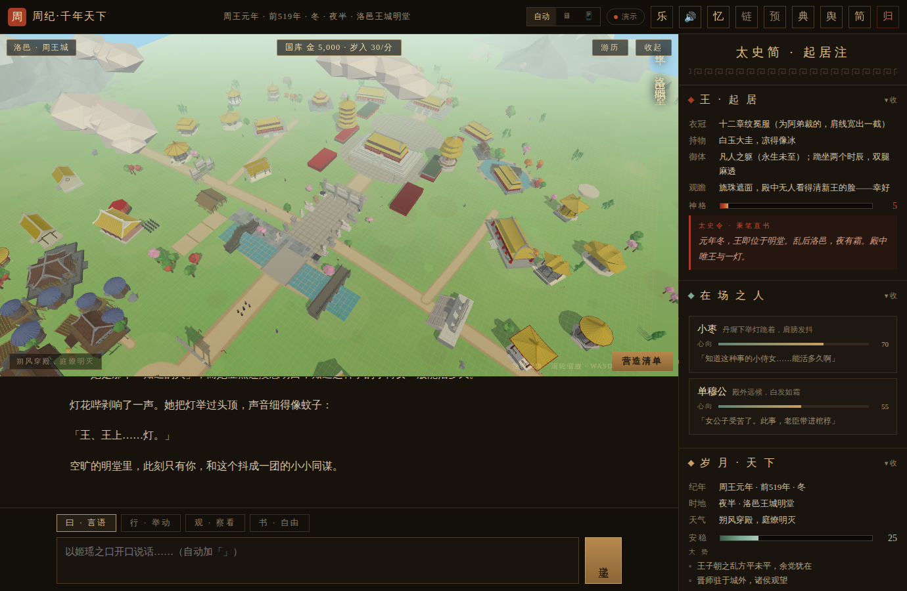
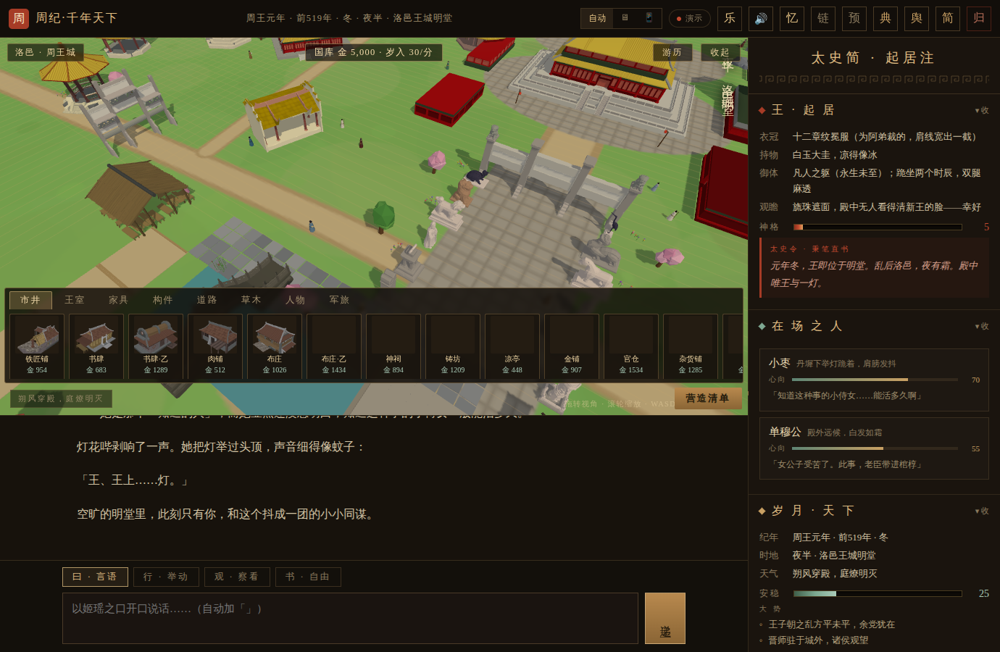
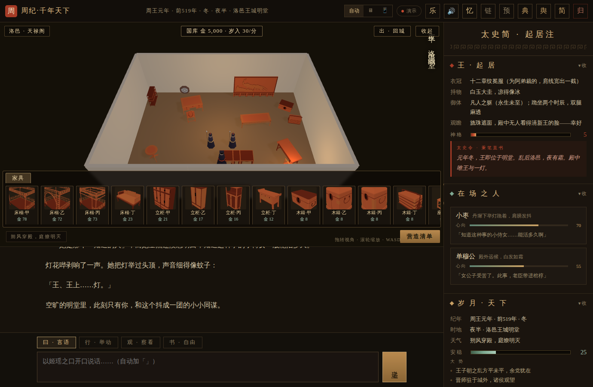
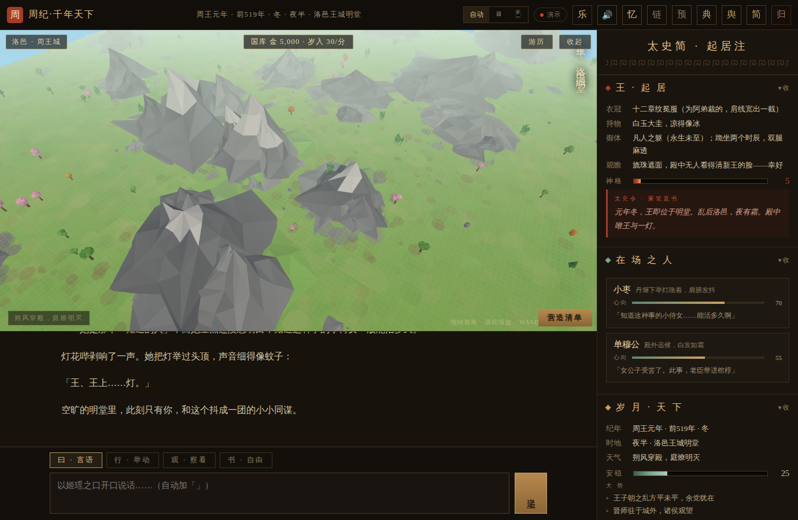
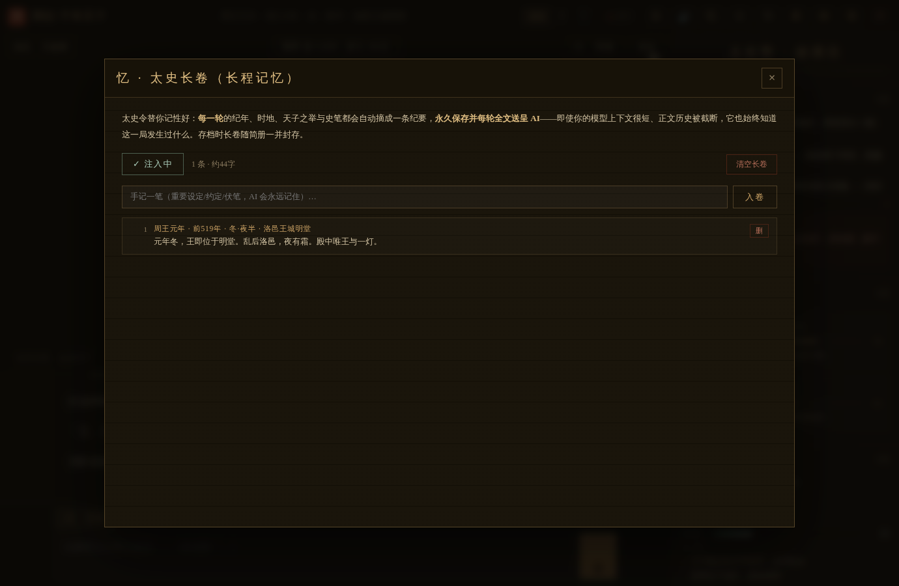

# Zhou Chronicle · A Thousand-Year Realm

**The Undying Son of Heaven · You are Ji Yao · The world is played by AI**

*A single-file, zero-install, AI-driven historical roleplay text game*

### 🎮 Play now → [**ekibenya.github.io/RitusZhou**](https://ekibenya.github.io/RitusZhou/)

*No download, no install — works on desktop & mobile; bring your own AI key and start*

[简体中文](README.md) | [English](README_EN.md)

---

> The bells of Luoyi have rung for a thousand years.
>
> Lords rise and fall, court historians wear out brush after brush — yet the sovereign upon the Bright Hall, **Ji Yao**, has never aged.
>
> You are her. There are no fixed options, no predetermined endings, no one waiting for you to make the "correct choice." Every word you speak and every move you make is recorded by the Grand Historian, retold by everyone in the hall, and woven into this thousand-year realm.

**Zhou Chronicle** is a SillyTavern-style AI roleplay text game: the AI plays the entire world — grand tutors, feudal lords, assassins, alchemists, street peddlers — while you, the immortal Son of Heaven of Zhou, write your own history across a millennium from Western Zhou to the Warring States.

*Luoyi, the royal capital — live god-view*

## ✦ Features

- **📜 Single-file game** — the whole game is one HTML file; download it and double-click to play, nothing to install
- **🎵 Ancient-music score** — eleven guqin / Chu-Ci pieces as background music, switchable and pausable from the "乐" control in the top bar
- **🎭 AI world narration** — no fixed options, no scripted endings; five action modes (Speak / Act / Observe / Freeform / **Decree**); Decree commands (build a stable ×2 / demolish the tavern / attack the granary / find Laozi / go south / travel to Ying) are **parsed and executed by the game itself** — the 3D city changes instantly and the AI only narrates the accomplished fact with the world reacting in real time
- **📖 Thousand-year lorebook** — nine built-in categories (the Zhou court, the Hundred Schools, the feudal states, Qin & Han, and more), auto-activated by context
- **🀄 Historian's panel** — per-turn status: the Sovereign's regalia, health, divinity and official record; each NPC's favor and inner thoughts; the era, weather and tides of the realm
- **🏯 3D realm · eight walkable cities** — above the chat lives a real-time 3D world: Luoyi and the seven capitals each built in their state's color (Zhou gold / Qin black / Chu red / Qi purple / Yan blue / Han green / Zhao tan / Wei teal); travel to another state and the city above transforms to match. Hit「游历」to expand the viewport and walk freely — WASD on desktop, virtual joystick on mobile — and step through doorways into interiors (the Bright Hall, study, bedchamber, tavern, royal archive…). All 457 low-poly ancient-Chinese building & furniture assets are placed in-world, with Luoyi the grandest: pailou gates, a fourteen-statue spirit way, the Mingtang altar, five palaces, twin pagodas and the Gongshu builders' yard
- **🏗️ Builder mode · shape your capital** (Pocket Build-style) — one tap switches to a god view with a golden grid: the build tray lists all 457 buildings / furniture / modules plus trees, bamboo, rocks and flowers, each priced; pick one to get a translucent ghost, drag it onto a cell, rotate freely through 360° (slider + 45° steps), tilt on all three X/Y/Z axes via the axis panel (10° per tap), overlap freely with existing buildings, scale from 0.5× to 5×, green-means-buildable — confirm to spend treasury gold, and the edict is automatically narrated into the story ("The Son of Heaven decrees: a tavern shall rise 24 paces east, 56 south — 480 gold, four days of corvée"), so the AI world reacts; placed works can be moved or demolished for a refund, every city keeps its own build save, and the treasury accrues income over time; press-and-drag any placed work to move it, and beyond the city walls lies a Minecraft-style **boundless wilderness** — chunk-generated grasslands and hills stretching forever, buildable anywhere
- **🧑‍🤝‍🧑 Populace & armies** — living pawns roam every city (20+ walks of life plus resident historical figures); click anyone to converse — the edict auto-enters the story and the AI plays them; the build tray recruits figures and fields whole army formations (guard/squad/camp/army) — select a unit, tap to march, tap a target to attack, with full battle chronicles narrated to the AI
- **🗺️ Realm chessboard** — the map is now an interactive board with the feudal capitals laid out across it; drag your piece onto another city to travel there — release to confirm the move, which costs a turn and triggers a live imperial-procession narration
- **🧠 Long-term memory** — every turn is auto-distilled into one chronicle line (era · place · your deed · the historian's record), kept forever and re-injected into every prompt, so even short-context models never forget what happened this run; add your own notes, prune entries, memory travels with saves
- **🛣️ Seven road types** — mud path / rammed earth / gravel / stepping stones / stone slabs / royal way / plank walkway, each an 8×8 m segment matching the built-in royal road
- **🏠 Every building enterable** — anything house-shaped gets a front door (eight interior layouts); in builder mode tap a building →「入内」to lift the roof and furnish it on the grid, one save per room, visible when you walk in later
- **🛡️ Imperial escort & teleport** — four guards escort the Son of Heaven (expandable, they fight assassins from the story; captivity openings strip them); tap the Emperor then a cell to teleport with the escort snapping into formation
- **📜 Batch chronicle** — building and demolition go into a ledger; hit「奏报」once to report the whole batch to the AI in a single edict
- **💾 Local saves** — up to twelve save slips in your browser
- **🔗 Bring your own AI** — OpenAI-compatible / Claude / Gemini endpoints; keys never leave your browser
- **🏗️ Narrative made real** — world changes recorded by the Grand Historian **act on the 3D city in real time**: a stable the Son of Heaven decrees gets truly built in town, a house that burns down in the story visibly collapses in flames, and a famous musician who arrives walks the streets; re-rolling a turn undoes the previous version's changes before replaying
- **🎴 Custom presets** — import your own SillyTavern chat-completion preset (it reads `prompts` / `prompt_order` and skips placeholder entries) or paste plain-text prompts; they're injected every turn in original order and stored in your browser; in SillyTavern mode the Tavern's own preset is used instead
- **🍺 SillyTavern compatible** — auto-detects the Tavern Helper (JS-Slash-Runner) bridge when loaded inside SillyTavern

| | |
|---|---|
|  |  |
| *Builder mode with the tray open* | *Roof-off interior furnishing* |
|  |  |
| *Boundless wilderness & mountain ranges* | *Long-term memory scroll* |

## ✦ Quick Start

**🌐 Play online (recommended)**: just open [**https://ekibenya.github.io/RitusZhou/**](https://ekibenya.github.io/RitusZhou/) — nothing to download.

**📥 Download & play offline**:

1. From the [**Releases page**](../../releases/latest), download:
   - `ZhouJi-QianNianTianXia-vX.X.X.zip` — **with background music**; unzip and open `index.html`
   - or `ZhouJi-QianNianTianXia-vX.X.X.html` — game only (no music, good for embedding in SillyTavern)
2. Open in any modern browser (Chrome / Edge / Firefox / Safari, mobile included)
3. Click **「链 · 接入」(Link · Connect)** on the title screen and enter your own AI API (see below)
4. Hit **Test Connection**, then **Start a New Game** — welcome back to Luoyi, Your Majesty

> ⚠️ The game ships **without an AI**. Until you connect your own API, it only plays canned demo responses.

## ✦ Connecting Your Own AI

The in-game **API Settings** panel supports three endpoint types. Your configuration is stored only in your browser's localStorage and **is sent nowhere except the endpoint you enter**:

| Type | Works with | Example Base URL | Example model |
|---|---|---|---|
| **OpenAI-compatible** | OpenAI, DeepSeek, Kimi, most API proxies | `https://api.deepseek.com/v1` | `deepseek-chat` |
| **Claude (official)** | Anthropic direct | `https://api.anthropic.com` (default) | `claude-sonnet-4-5` |
| **Gemini (official)** | Google AI Studio direct | `https://generativelanguage.googleapis.com` (default) | `gemini-2.5-pro` |

After entering your key, click **Fetch Models** to list available models, then **Test Connection** to verify the link.

**FAQ**

- **CORS errors?** Some providers block direct browser calls. Anthropic, Google and most proxies allow it; if your OpenAI-compatible provider doesn't, use a CORS-enabled proxy URL.
- **Is my key safe?** Keys live only in your local browser storage — this project has no server. Don't save keys on shared computers; use "Clear local key" in settings when done.
- **Broken / truncated replies?** Click "Replay this scene" under the reply to regenerate the turn.

## ✦ Playing inside SillyTavern

If you already run SillyTavern, load this HTML through the **Tavern Helper (JS-Slash-Runner)** extension: the game auto-detects the bridge and drives generation through SillyTavern instead, sharing its chat history and swipes — no API setup needed.

## ✦ Releases

Distributed via [GitHub Releases](../../releases). Each release ships:

- `ZhouJi-QianNianTianXia-vX.X.X.html` — the game itself (download & play)
- `ZhouJi-QianNianTianXia-vX.X.X.zip` — game + documentation bundle

## ✦ Assets & Disclaimer

- The 3D models/textures are **runtime conversions** of commercial low-poly asset packs, consolidated into a single encoded data pack (`zjw.dat`) solely so the game can render in the browser; the source packages are not distributed with this repository — **unpacking, extracting, or any other use is prohibited**.
- Historical figures and events are fictionalized for entertainment. AI-generated content comes from the model you connect and is unrelated to this project.
- **Terms of use**: all rights reserved — this project is **for playing only**. Online play, offline play via Releases, and sharing links are permitted; derivative works, modification, redistribution, commercial use, and asset extraction are prohibited. See [LICENSE](LICENSE) (bilingual, 中文 + English).

---

*The bell has tolled; the bamboo slips are open.*

**"Your Majesty — today's realm awaits your brush."**

